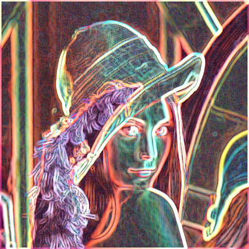

# TileProcessingGroupShared

This is a proof-of-concept project, which I made when I was thinking about how to create padded tiles when processing image using localshared memory in a compute shader. This is continuation of my Gaussian blur test which uses groupshared memory.

There might still be a few things wrong in this and it might be (most likely) not really useful, and it's much more complicated than just accessing a texture to different directions from the current pixel. But I wanted to figure out how I can calculate indicies for padded data and how to copy data to the the padding zones. Might come useful later in another project.

I created a Sobel convolution filter as a test visualization to see if texture lookups happen in correct locations etc.

## Features

- This test setup has just a simple scene, and you can adjust the test parameters in the Inspector
- You can select an image to test the convolution filter on
- Processed image is blitted to the screen
- I left in a few development-time thread debug visualizations to help understand the logic

## Notes

- Built in Unity 2018.4, most likely works on later versions
- This implementation assumes a square image
- Verbose comments in the code in case you find this interesting...
